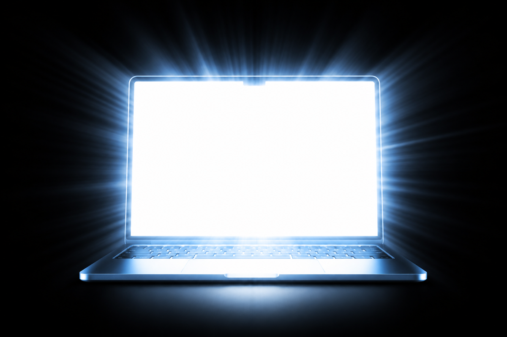

  

<h1 align="center">RayXDR</h1>

  Push built-in MacBook XDR displays beyond standard brightness.

RayXDR is a small macOS utility for forcing extra brightness on built-in MacBook XDR displays.

It exists because this tiny but useful feature is often locked behind paid apps. RayXDR keeps it simple: install it, use it, pay nothing.

## Installation

[Download the latest release](https://github.com/MrFlashAccount/RayXDR/releases/latest), open the DMG, and drag `RayXDR.app` to `Applications`.

RayXDR is not notarized. On first launch, use right click -> `Open`.

## Usage

Launch RayXDR from `Applications`. Use the menu bar icon to switch between `Standard`, `RayXDR 150%`, and `Reset`.

Use `Reset` if the display state looks wrong. RayXDR is built for built-in MacBook XDR displays.
